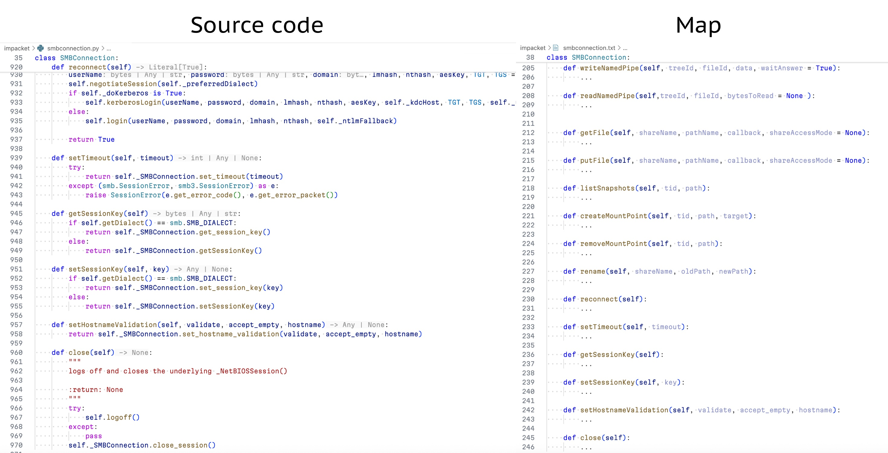

# mapgen

This is a tool for generating map of a code repository.

Map is a shorter representation of code, that includes everything except functions content.  It is used to fed it to an AI agent as a context.

It is inspired by Aider's [repository map](https://aider.chat/docs/repomap.html) and [Shotgun](https://github.com/glebkudr/shotgun_code) tool.



## Usage

```bash
mapgen SOURCES... [-o|--output OUTPUT_FILE] [-w|--watch] [-d|--depth N]
```
- `SOURCES` — paths to files or directories to generate map for.  Can be a single file, a directory, or a glob pattern.  It can be both before and after all other options.
- `-o OUTPUT_FILE` or `--output OUTPUT_FILE` — output file to write map to.  If not specified, map will be printed to stdout.
- **(not implemented yet)** `-w` or `--watch` — watch for changes in sources and re-generate map on change.  Can only be used with the output file specified.
- `-d N` or `--depth N` — depth of the traversal.  Default is 99999.

### Examples

- Just print files map to stdout, copy it to clipboard and paste it to ChatGPT or Google AI Studio:
```bash
mapgen path/to/file.rs path/to/file2.rs | pbcopy
```

- Create automatically updating map of all Rust files in the repository to a file, so it could be added to Cursor's context using `@` at any time:
```bash
mapgen ./**/*.rs -o map-rust.txt -w
```

## Development

To run the project, install Rust toolchain first, for example:
```bash
brew install rustup
rustup toolchain
rustc -V && cargo -V
```

After that, just run this to build and run the project:
```bash
cargo run -- "**/*.rs"
```

Or build it and copy to some directory in `$PATH`:
```bash
cargo build --release
cp target/release/mapgen ~/.local/bin/mapgen
```

### Adding new languages

To add a new language support, just do this:
- add a new tree-sitter dependency, for example: `cargo add tree-sitter-python`;
- add a new language variant to `Language` enum in `src/parser/languages.rs` and all corresponding functions;
- add a test file to `src/parser/test_data/`.
